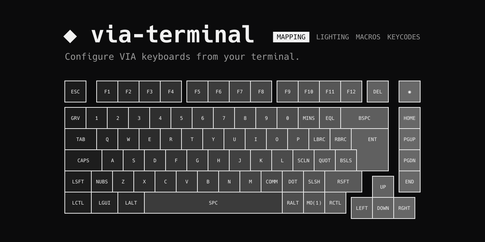

# via-terminal

A terminal UI for VIA keyboards: remap keys, change lighting, edit macros, back up your keymap. Tested on Linux; the macOS and Windows builds are untested so far.

## Install

    go install github.com/bulkinglb/via-terminal@latest

Or download a binary from [Releases](https://github.com/bulkinglb/via-terminal/releases).

## Setup (Linux)

Allow access to the keyboard, then replug it:

    echo 'KERNEL=="hidraw*", SUBSYSTEM=="hidraw", MODE="0660", TAG+="uaccess"' | sudo tee /etc/udev/rules.d/99-via.rules

## Use

    via-terminal                      # open the editor
    via-terminal export keymap.json   # save the keymap and macros
    via-terminal import keymap.json   # load them back
    via-terminal reset                # restore the default keymap

Boards without a bundled definition need `--def board.json`.

MIT license.
